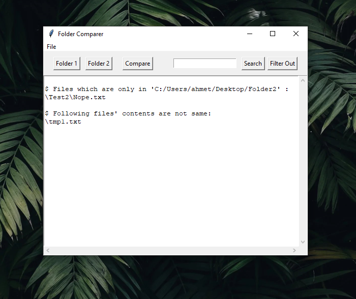
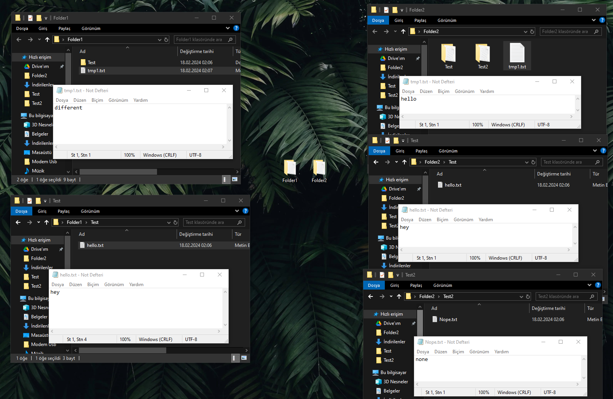

# Folder Comparer

This Python script (`Folder Comparer.pyw`) allows you to compare the contents of two folders and identify differences between them.

## Features

- **Folder Comparison:** Compares the contents of two selected folders.
- **File Equality Check:** Checks if the files in the common set between folders have the same content.
- **Output Filtering:** Allows you to filter and search through the output.

## Usage

1. Ensure you have [Python](https://www.python.org/downloads/) installed as a dependency.
2. Run the script by clicking on `Folder Comparer.pyw` and selecting "Run with Python."
3. Select the folders you want to compare using the "Folder 1" and "Folder 2" buttons.
4. Click the "Compare" button to analyze the folders.
5. View the results in the text area.

## Additional Operations

- **Search:** Enter a string to search for in the output.
- **Filter Out:** Enter a string to filter out unwanted results.
- **Save to File:** Save the output to a text file.
- **Import Output:** Import a previously saved output.
